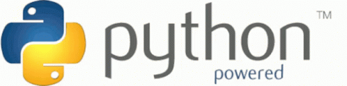

.
# developer_python
>This repository is dedicated to making code in Python
# Clase 1
> # ¿ Qué es Python?
Es un lenguaje de  programación utlizado  en el desarrollo de software,la ciencia  de datos y el machine learning(ML)
Es eficiente y fácil de aprender,además de  que se puede ejecutar en muchas plataformas diferentes.
># Beneficios de usar python
* sintaxis básica similar ala del inglés.
* Requiere  menos líneas de código en comparación con muchos otros lenguajes.
* Cuenta con una gran biblioteca estándar que contiene códigos reutilizables para  casi  cualquier tarea.
* Integración con otros lenguajes de programación conocidos,comojava,c y c++
* Buen y rápido soporte de la comunidad.
* Python se puede trasladar a través de diferentes sistemas operativos de  computadora,como   windows,macOS,Linux y 
Unix
# Clase 2
> # Fundamentos de Programación en Python
* !Bienvenido! En este  archivo,aprenderás los fundamentos básicos de programación en Python.Este es el primer paso para convertirte en un programador.!Empecemos!
## 1. Variables
Las variables son "cajas" donde podemos almacenar información.En Python se crean de manera sencilla:
>##### nombre="juan"
>##### edad=25
>##### altura=1.75
En este ejemplo

>* ##### nombre :   almacena una cadena  de texto (string) "juan"


# Developer Python
> **Este repositorio está dedicado a crear código en Python.**

## Clase 1
### ¿Qué es Python?
Es un lenguaje de programación utilizado en el desarrollo de software, la ciencia de datos y el machine learning (ML).
Es eficiente y fácil de aprender, además de que se puede ejecutar en muchas plataformas diferentes.

### Beneficios de usar Python
- **Sintaxis básica:** Similar a la del inglés.
- **Menos líneas de código:** Requiere menos líneas de código en comparación con muchos otros lenguajes.
- **Gran biblioteca estándar:** Contiene códigos reutilizables para casi cualquier tarea.
- **Integración:** Compatible con otros lenguajes de programación conocidos como Java, C, y C++.
- **Soporte comunitario:** Buen y rápido soporte de la comunidad.
- **Portabilidad:** Python se puede trasladar a través de diferentes sistemas operativos como Windows, macOS, Linux y Unix.

## Clase 2
### Fundamentos de Programación en Python
¡Bienvenido! En este archivo, aprenderás los fundamentos básicos de programación en Python. Este es el primer paso para convertirte en un programador. ¡Empecemos!

### 1. Variables
Las variables son "cajas" donde podemos almacenar información. En Python se crean de manera sencilla:

```python
nombre = "juan"
edad = 25
altura = 1.75
En este ejemplo:

nombre: almacena una cadena de texto (string) "juan"
edad: almacena un número entero (int) 25
altura: almacena un número decimal (float) 1.75
